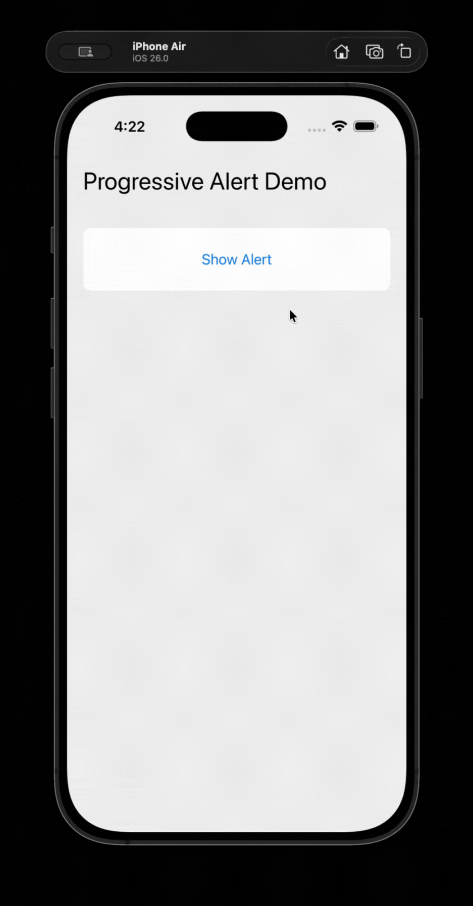

# rn-progresive-alert

rn-progresive-alert lets React Native and Expo apps show a **native iOS progress alert**, perfect for long-running operations like uploads, downloads, or data processing. The alert uses iOS’s UIAlertController with an attached UIProgressView, exposing APIs for JS to control progress and listen for cancel/complete events. 

**Only Ios Supported** 

## Preview



---

## 1. Installation & setup

keep using prebuild/EAS for Expo or install + pod install for bare RN.

```bash
npm install rn-progresive-alert
# then
cd ios && pod install && cd ..

# For Expo-managed apps: prebuild or use EAS builds
npx expo prebuild
eas build -p ios
```

---

## 2. API

### JS surface (public)

```ts
// default export (convenience) + named exports
import ProgressiveAlert, {
  addListener,
  show,
  update,
  dismiss,
} from "rn-progresive-alert";

// or
import { show, update, dismiss, addListener } from "rn-progresive-alert";
```

### Functions

```ts
addListener(event: ProgressiveAlertEvent, listener: () => void): { remove(): void }
show(config: ProgressiveAlertConfig): Promise<ProgressiveAlertShowResult>
update(progress: number): Promise<void>
dismiss(): Promise<ProgressiveAlertDismissResult>
```

### Types

```ts
// config passed to show()
export interface ProgressiveAlertConfig {
  title: string;
  message: string;
  tint?: string; // named color or hex like '#007AFF'
  initialProgress?: number; // 0..1
  replaceIfPresented?: boolean; // default true
  cancelTitle?: string | null; // null hides cancel button
  completeAutoDismiss?: boolean; // default true
  forceFallback?: boolean;
  fallbackOffset?: number; // px
}

// result types
export interface ProgressiveAlertShowResult {
  presented: boolean;
}
export interface ProgressiveAlertDismissResult {
  dismissed: boolean;
}

// native emitter event names (for addListener)
export type ProgressiveAlertEvent = "cancelled" | "completed";

// hook-level event names (the hook forwards native events to these)
export type HookProgressiveAlertEvent = "onCancelled" | "onCompleted";
```

**Note:** `show()` returns `{ presented: false }` if the native module wasn't included in the binary (common in Expo managed without prebuild). Always check it and provide a JS fallback UI if needed.

---

## 3. Events — exactly how to listen

There are two ways to subscribe:

### A — Directly to the native emitter (use this when you want raw native events)

Native event names: **`'cancelled'`** and **`'completed'`**.

```ts
// raw listener example
import ProgressiveAlert from "rn-progresive-alert";

const sub = ProgressiveAlert.addListener("cancelled", () => {
  // user tapped cancel
});

// cleanup
sub.remove();
```

### B — Using the hook (convenience)

The hook listens to the native emitter and **forwards** events as `onCancelled` / `onCompleted`. This is helpful for components that prefer the `onXxx` naming convention.

```ts
import { useProgressiveAlert } from "rn-progresive-alert";

const { show, update, dismiss } = useProgressiveAlert((event) => {
  if (event === "onCancelled") {
    // hook forwarded the native 'cancelled' event
  }
});
```

---

## 4. Examples

### Example A — Minimal (default import)

```tsx
import React from "react";
import { View, Button } from "react-native";
import ProgressiveAlert from "rn-progresive-alert";

export default function Example() {
  const onShow = async () => {
    const { presented } = await ProgressiveAlert.show({
      title: "Processing",
      message: "Please wait...",
      initialProgress: 0,
      cancelTitle: "Cancel",
    });

    if (!presented) {
      // native not present — show JS fallback
      return;
    }

    let p = 0;
    const t = setInterval(async () => {
      p += 0.12;
      if (p >= 1) {
        clearInterval(t);
        await ProgressiveAlert.dismiss();
      } else {
        await ProgressiveAlert.update(p);
      }
    }, 300);
  };

  return (
    <View>
      <Button title="Show" onPress={onShow} />
    </View>
  );
}
```

### Example B — Upload flow (use raw emitter)

```tsx
import React, { useEffect } from "react";
import { Button } from "react-native";
import { show, update, dismiss, addListener } from "rn-progresive-alert";

export default function UploadFlow() {
  useEffect(() => {
    const subCancel = addListener("cancelled", () => {
      // cancel upload (AbortController or library cancel)
      console.log("user cancelled");
    });

    const subComplete = addListener("completed", () => {
      console.log("native completed");
    });

    return () => {
      subCancel.remove();
      subComplete.remove();
    };
  }, []);

  const start = async () => {
    const { presented } = await show({
      title: "Uploading",
      message: "Uploading file...",
      initialProgress: 0,
    });
    if (!presented) {
      // fallback
      return;
    }

    for (let i = 0; i <= 10; i++) {
      await update(i / 10);
      await new Promise((r) => setTimeout(r, 250));
    }

    await dismiss();
  };

  return <Button title="Start" onPress={start} />;
}
```

### Example C — Using the hook (for `onCancelled` / `onCompleted`)

```tsx
import { useProgressiveAlert } from "rn-progresive-alert";

function SyncTask() {
  const { show, update, dismiss } = useProgressiveAlert((event) => {
    if (event === "onCancelled") {
      // user cancelled via native alert
    }
    if (event === "onCompleted") {
      // finished
    }
  });

  const run = async () => {
    await show({ title: "Syncing", message: "Working..." });
    for (let i = 0; i <= 10; i++) {
      await update(i / 10);
      await new Promise((r) => setTimeout(r, 150));
    }
    await dismiss();
  };
}
```
